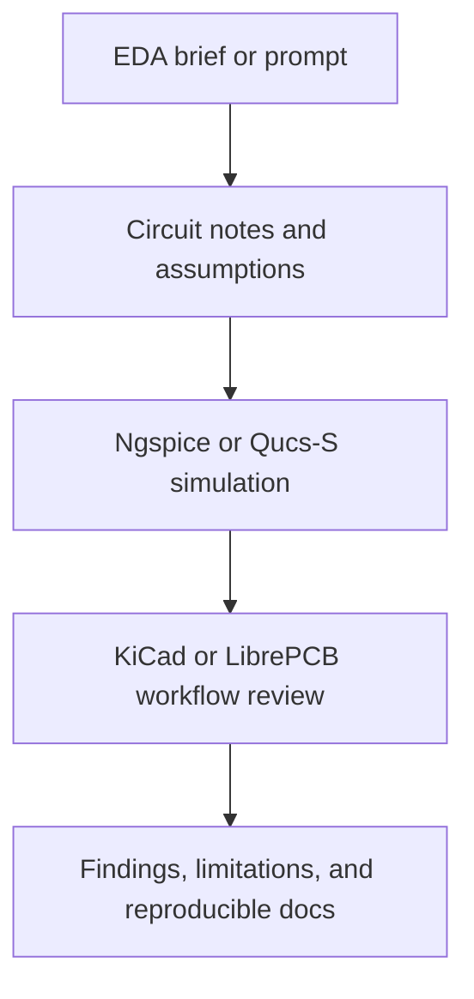

# Electronics Design & Simulation - EDA Work Samples

This repository is a self-directed portfolio of electronics design and simulation work samples. It is intentionally honest: these are documentation, simulation, and review exercises created to demonstrate EDA understanding, not client work, not manufactured hardware, and not proof of physical board validation.

## About This Portfolio

The goal of this portfolio is to show how I approach electronics tasks with the same discipline I use in software engineering: clear requirements, explicit assumptions, reproducible steps, and structured review. The samples focus on basic analog simulation, schematic and PCB workflow understanding, BOM documentation, and critical evaluation of AI-generated EDA content.

## Tools Referenced

| Tool | Role in this portfolio |
| --- | --- |
| KiCad | Schematic capture, footprint assignment, PCB layout review, ERC/DRC awareness |
| LibrePCB | Alternative EDA workflow reference for schematic and board organization |
| Ngspice | Netlist-based circuit simulation and frequency-response review |
| Qucs-S | GUI-oriented circuit simulation reference and result interpretation |

## Skills Demonstrated

- Circuit simulation documentation
- SPICE netlist interpretation
- Schematic workflow understanding
- Basic PCB design review concepts
- Component and BOM documentation
- ERC and DRC awareness
- AI-generated EDA output evaluation
- Reproducible technical documentation

## Projects

| Project | Focus | Key Files |
| --- | --- | --- |
| [RC Low-Pass Filter in ngspice](projects/01-rc-low-pass-filter-ngspice/README.md) | Beginner-friendly analog simulation and frequency-response interpretation | `rc-low-pass.cir`, `expected-results.md`, `quality-checklist.md` |
| [555 Timer LED Blinker](projects/02-555-timer-led-blinker/README.md) | Conceptual KiCad workflow, BOM planning, and simulation vs hardware boundaries | `schematic-workflow.md`, `simulation-notes.md`, `bill-of-materials.md`, `limitations.md` |
| [EDA AI Output Quality Review](projects/03-eda-ai-output-quality-review/README.md) | Reviewing flawed AI-generated EDA instructions and rewriting them clearly | `fake-ai-generated-answer.md`, `review-findings.md`, `improved-answer.md`, `evaluation-checklist.md` |

## Why This Helps With AI And EDA Asset Evaluation

This repository is also meant to support AI research and EDA asset evaluation work. The examples show how I inspect output for missing units, missing ground references, unclear simulator assumptions, absent validation steps, and overconfident claims that simulation alone proves a working PCB. That review mindset is useful when judging generated technical content for correctness, reproducibility, and safety.

## Portfolio Links

- Portfolio: https://dev.parley.live
- GitHub: https://github.com/YOUR_USERNAME

## Notes

- No claim is made here of senior electrical engineering experience.
- No fabricated PCB manufacturing, lab testing, or reliability validation is presented.
- The focus is on clarity, discipline, and reproducible documentation.
