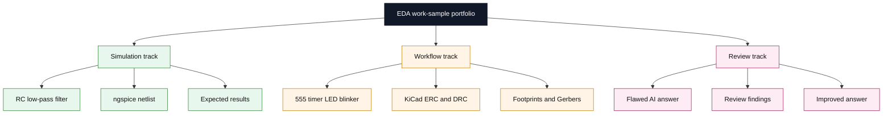

# Electronics Design & Simulation - EDA Work Samples

This repository is a self-directed portfolio of electronics design and simulation work samples. It shows how I document circuit behavior, review schematic and PCB workflows, and evaluate AI-generated EDA content with an emphasis on correctness, reproducibility, and explicit assumptions. It is not client work, not a manufactured product set, and not proof of physical board validation.

## Portfolio Snapshot

<table>
  <tr>
    <td valign="top" width="33%">
      <strong>Simulation</strong> 
      RC low-pass filter in ngspice 
      AC source, resistor, capacitor, and ground 
      Cutoff frequency and frequency-response review
    </td>
    <td valign="top" width="33%">
      <strong>Workflow</strong> 
      555 timer LED blinker 
      KiCad schematic flow, ERC, DRC, and footprints 
      PCB layout and Gerber generation notes
    </td>
    <td valign="top" width="33%">
      <strong>Review</strong> 
      EDA AI output quality review 
      Find flaws, rewrite instructions, and verify assumptions 
      Reproducible evaluation checklist
    </td>
  </tr>
</table>

The diagram below shows how the repository is organized around simulation, workflow review, and AI-output evaluation.

## About

Description: this is a self-directed EDA work-sample portfolio focused on circuit simulation documentation, schematic and PCB workflow review, and AI-output evaluation.

The goal of this portfolio is to show how I approach electronics tasks with the same discipline I use in software engineering: clear requirements, explicit assumptions, reproducible steps, and structured review. Each sample is built to be readable on its own and to demonstrate how I think about a circuit from the brief, through the simulation or workflow steps, to the documented result and limitations.

These samples focus on basic analog simulation, schematic and PCB workflow understanding, BOM documentation, ERC and DRC awareness, and critical evaluation of AI-generated EDA content. The intent is to demonstrate EDA literacy and disciplined documentation, not to claim senior electrical engineering experience or fabricated hardware validation.

## Tools Referenced

| Tool | Role in this portfolio |
| --- | --- |
| KiCad | Schematic capture, footprint assignment, PCB layout review, ERC/DRC awareness |
| LibrePCB | Alternative EDA workflow reference for schematic and board organization |
| Ngspice | Netlist-based circuit simulation and frequency-response review |
| Qucs-S | GUI-oriented circuit simulation reference and result interpretation |

## Skills Demonstrated

- Circuit simulation documentation
- SPICE netlist interpretation
- Schematic workflow understanding
- Basic PCB design review concepts
- Component and BOM documentation
- ERC and DRC awareness
- AI-generated EDA output evaluation
- Reproducible technical documentation

## Projects

| Project | Focus | Key Files |
| --- | --- | --- |
| [RC Low-Pass Filter in ngspice](projects/01-rc-low-pass-filter-ngspice/README.md) | Beginner-friendly analog simulation and frequency-response interpretation | `rc-low-pass.cir`, `expected-results.md`, `quality-checklist.md` |
| [555 Timer LED Blinker](projects/02-555-timer-led-blinker/README.md) | Conceptual KiCad workflow, BOM planning, and simulation vs hardware boundaries | `schematic-workflow.md`, `simulation-notes.md`, `bill-of-materials.md`, `limitations.md` |
| [EDA AI Output Quality Review](projects/03-eda-ai-output-quality-review/README.md) | Reviewing flawed AI-generated EDA instructions and rewriting them clearly | `fake-ai-generated-answer.md`, `review-findings.md`, `improved-answer.md`, `evaluation-checklist.md` |

## Why This Helps With AI And EDA Asset Evaluation

This repository is also meant to support AI research and EDA asset evaluation work. The examples show how I inspect output for missing units, missing ground references, unclear simulator assumptions, absent validation steps, and overconfident claims that simulation alone proves a working PCB. That review mindset is useful when judging generated technical content for correctness, reproducibility, and safety.

## GitHub

- GitHub: https://github.com/onehermes

## Notes

- No claim is made here of senior electrical engineering experience.
- No fabricated PCB manufacturing, lab testing, or reliability validation is presented.
- The focus is on clarity, discipline, and reproducible documentation.
