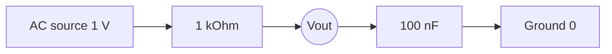

# RC Low-Pass Filter in ngspice

## Objective

Demonstrate a simple, beginner-friendly analog simulation that shows how a first-order RC low-pass filter behaves in the frequency domain.

## Circuit Overview

The sample uses:

- `R1 = 1 kOhm`
- `C1 = 100 nF`

The expected cutoff frequency is:

`f_c = 1 / (2*pi*R*C) ~ 1.59 kHz`

That means the output should remain close to the input at low frequencies and then roll off at roughly `-20 dB/decade` after the cutoff point.

## Files

- [`rc-low-pass.cir`](rc-low-pass.cir)
- [`circuit-notes.md`](circuit-notes.md)
- [`expected-results.md`](expected-results.md)
- [`quality-checklist.md`](quality-checklist.md)

## What This Sample Shows

- How to read a simple SPICE netlist
- How a ground reference is represented in ngspice
- How an AC sweep is used to inspect frequency response
- How to document expected behavior before running a simulation

## Scope

This is a simulation-only work sample. It does not claim PCB fabrication, lab measurement, or physical reliability testing.
