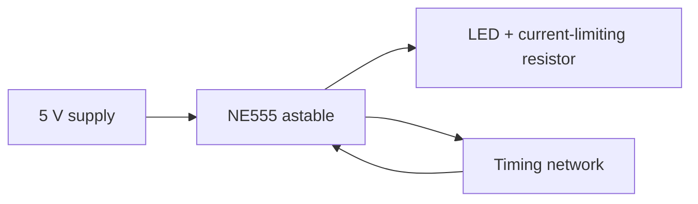

# 555 Timer LED Blinker

## Objective

Document a conceptual EDA workflow for a 555 astable oscillator used to blink an LED from a `5 V` supply.

## Visual Overview

## Basic Description

A 555 timer in astable mode repeatedly charges and discharges a timing capacitor through a resistor network. That creates a square-wave output, which can be used to blink an LED at a visible rate.

## Example BOM

- NE555 timer
- Resistors
- Capacitor
- LED
- Current-limiting resistor
- `5 V` supply

## KiCad Workflow

The related workflow notes are in [`schematic-workflow.md`](schematic-workflow.md).

## Simulation And Validation

The simulation notes are in [`simulation-notes.md`](simulation-notes.md).

## Scope

This sample is about workflow clarity and documentation. It does not claim a fabricated board or real hardware measurements.
