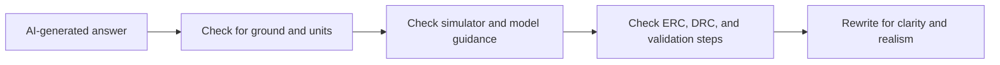

# EDA AI Output Quality Review

## Objective

Show how I would evaluate AI-generated EDA instructions for correctness, completeness, and reproducibility.

## Visual Review Flow

## Files

- [`fake-ai-generated-answer.md`](fake-ai-generated-answer.md)
- [`review-findings.md`](review-findings.md)
- [`improved-answer.md`](improved-answer.md)
- [`evaluation-checklist.md`](evaluation-checklist.md)

## What This Demonstrates

- Identifying missing assumptions
- Catching overclaims in technical answers
- Rewriting confusing instructions into a reproducible workflow
- Applying a structured review checklist to EDA content
